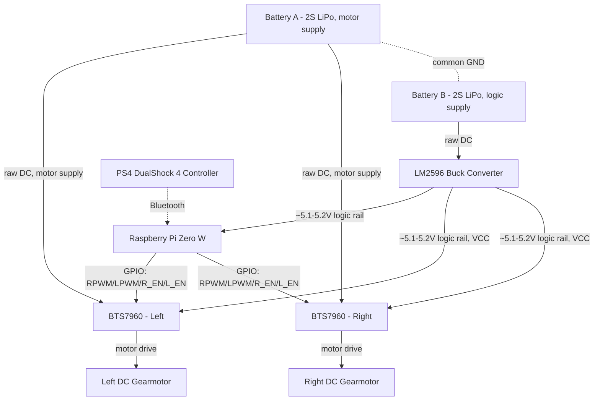
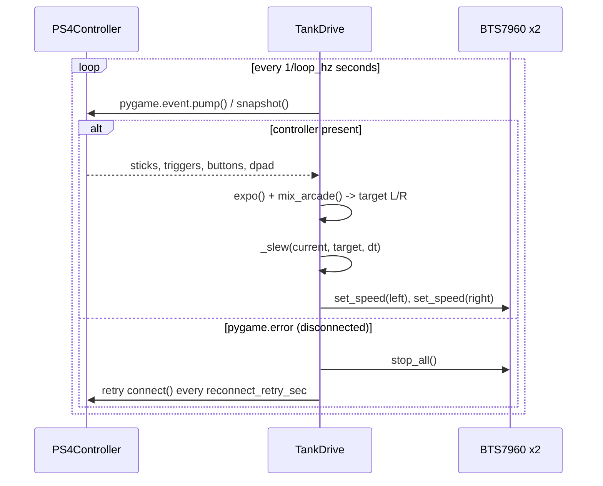

# RC Tank — Engineering Documentation

## Contents

1. [Overview](#1-overview)
2. [System Architecture](#2-system-architecture)
3. [Bill of Materials](#3-bill-of-materials)
4. [Power Architecture](#4-power-architecture)
5. [Wiring and Pin Mapping](#5-wiring-and-pin-mapping)
6. [Software Architecture](#6-software-architecture)
7. [Running the Project](#7-running-the-project)
8. [Testing and Validation Procedure](#8-testing-and-validation-procedure)
9. [Troubleshooting](#9-troubleshooting)
10. [Optional: Peripherals to Disable](#10-optional-peripherals-to-disable-power-saving)
11. [Known Limitations / Future Work](#11-known-limitations--future-work)

---

## 1. Overview

Tracked tank platform built on a Raspberry Pi Zero W, tele-operated over
Bluetooth by a Sony DualShock 4 (PS4) controller. Drive power is delivered
by two independent BTS7960 H-bridge modules (one per track), each running
one brushed DC gearmotor. Control software runs on the Pi and translates
controller input into arcade-mixed PWM commands for each side.

This document covers the electrical bill of materials, wiring/pin mapping,
software architecture, safety features, operating procedure, and
troubleshooting reference for the project.

---

## 2. System Architecture



Two separate 2S LiPo packs are used, each dedicated to one domain:
**Battery A** feeds the BTS7960 motor-supply inputs directly, and
**Battery B** feeds the LM2596 buck converter, whose output is a shared 5V
logic rail that powers the Pi *and* each BTS7960's logic `VCC` directly (a
parallel tap, not routed through the Pi). Only the GPIO signal lines
(`RPWM`/`LPWM`/`R_EN`/`L_EN`) run from the Pi to the BTS7960 modules — no
power passes through the Pi's pins to reach them.

> **Common ground requirement:** even though the two batteries are
> electrically separate packs, their negative terminals must be tied
> together (along with the Pi and both BTS7960 grounds). The Pi's GPIO
> signal lines need a shared ground reference with the BTS7960 modules to
> read a valid logic level — without a common GND, PWM control will be
> erratic or non-functional even though each domain has its own supply.

Software runs entirely on the Pi: `ps4_controller_test.py` provides the
controller abstraction, `tank_ps4_control.py` reads it and drives the
motors through `RPi.GPIO`.

---

## 3. Bill of Materials

| Qty | Component | Notes / Specs to verify |
|----:|-----------|--------------------------|
| 1 | Raspberry Pi Zero W | Single-core, 512MB RAM, built-in Wi‑Fi/Bluetooth (shared antenna — see §9 Troubleshooting) |
| 1 | LM2596 (or equivalent) buck converter | Input: Battery B (logic pack); output trimmed to ~5.1–5.2V no‑load to feed the Pi's 5V rail and both BTS7960 logic `VCC` pins |
| 2 | 2S LiPo battery pack (Battery A: motor supply, Battery B: buck converter/logic) | Nominal 7.4V / ~8.4V full charge per 2S pack — verify against the BTS7960 motor-supply voltage range and the LM2596 input range before use. Batteries are electrically separate but must share a common GND (see §2) |
| 2 | BTS7960 H-bridge module (one per side) | ⚠ Verify your specific module's datasheet: motor supply voltage range and peak current rating vary by vendor/clone. Commonly sold as capable of large peak currents, but continuous rating is usually much lower without a heatsink/fan |
| 2 | DC gearmotor (one per track) | ⚠ Record nominal voltage, no‑load current, and stall current from the motor's datasheet — needed to size wiring gauge and fusing |
| 1 | Tank chassis / tracks | — |
| 1 | PS4 DualShock 4 controller ("Wireless Controller") | Paired to the Pi over Bluetooth |
| — | Wiring, connectors, fuses | See §4 Power Architecture |

> **Engineering note:** the values above marked ⚠ are intentionally left as
> placeholders. Fill them in from your actual component datasheets before
> finalizing wire gauge, fuse rating, and battery sizing — do not assume
> generic "BTS7960 module" numbers found online apply to your specific
> board without checking.

---

## 4. Power Architecture

Two independent battery packs, each dedicated to one power domain:

1. **Logic/control domain** — Battery B (2S LiPo) → buck converter →
   shared 5V/GND rail. This rail feeds the Pi *and* both BTS7960 modules'
   logic `VCC` directly and in parallel — the BTS7960 logic supply does
   **not** come from the Pi's 5V pin, it taps the buck converter's output
   alongside it. Only GPIO signal lines (`RPWM`/`LPWM`/`R_EN`/`L_EN`) run
   from the Pi to the BTS7960 modules.
2. **Motor domain** — Battery A (2S LiPo) → BTS7960 motor-supply input →
   motor. This path carries the full drive current and should be wired
   with appropriately sized conductors, kept short, and fused close to
   the battery.

Using two separate packs isolates motor switching noise and voltage sag
from the logic supply, which helps prevent Pi brownouts and Bluetooth/Wi‑Fi
glitches during hard acceleration. This isolation only holds if the two
packs' negative terminals are still tied to a common ground (see §2) —
otherwise the Pi's GPIO signals have no valid reference relative to the
BTS7960 inputs.

**Recommended safety additions (not yet implemented in wiring described
here):**
- An inline fuse (or resettable PTC) on each battery's positive line,
  sized to that domain's expected peak current (motor stall current for
  Battery A; buck converter input current for Battery B) plus margin.
- A physical power switch / battery disconnect accessible without tools,
  ideally one per pack.
- Decoupling capacitance close to each BTS7960's motor-supply input if
  motor electrical noise causes Pi brownouts or Bluetooth glitches.

In practice, the 5V and GND rails on the logic side are shared: one 5V
line from the buck converter feeds the Pi and both BTS7960 logic `VCC`
pins in parallel. Separately, one common GND ties everything together —
Pi, both BTS7960 logic grounds, Battery A negative, and Battery B
negative — even though the two batteries are otherwise independent supplies.

### 4.1 Preventing Brownouts / Current-Drop Reboots

If the Pi resets, hangs, or fails to boot under load (a classic symptom is
the under-voltage lightning-bolt icon, or `dmesg`/`vcgencmd` reporting a
throttled state), the root cause is almost always the logic rail sagging
below the Pi Zero W's under-voltage threshold (~4.63V) for a moment,
even with the motor supply on a separate battery. Diagnose and fix in
this order:

1. **Confirm it's a power issue, not an SD card/software issue:**
   ```bash
   vcgencmd get_throttled     # non-zero bit 0 = under-voltage has occurred
   dmesg | grep -i voltage    # look for "Under-voltage detected" entries
   ```
2. **Check Battery B's (logic pack) resting and loaded voltage** with a
   multimeter. A 2S LiPo should read ~7.4–8.4V resting; if it sags
   noticeably under just the Pi's load, the pack is undersized, aged, or
   has a poor C-rating for its internal resistance — replace or upsize it.
   Don't run it near its low-voltage cutoff; sag is worst near empty.
3. **Re-check the buck converter's output voltage under load**, not just
   no-load. Adjust it toward ~5.15–5.25V no-load (Pi tolerates 5V ±5%) so
   there is headroom before it sags under a transient into the Pi's
   under-voltage range. Do not exceed the Pi's rated input.
4. **Add bulk capacitance** at the buck converter's output, right at the
   Pi's 5V/GND pins (e.g., a low-ESR 470–1000 µF electrolytic plus a 100nF
   ceramic bypass). This smooths short transient loads such as Wi‑Fi/
   Bluetooth radio bursts that a small battery/converter alone can't
   supply fast enough.
5. **Inspect every connector and wire gauge on the logic path** (Battery B
   → buck converter → Pi). Loose Dupont/jumper connectors and thin wire
   are a very common cause of intermittent sag, especially with the
   vibration from moving tracks — solder or crimp proper connectors and
   use adequately thick wire for this path.
6. **Verify the common-GND tie between the two battery domains is solid**
   (short, adequately thick, single star point near the Pi/buck converter)
   rather than a thin wire daisy-chained through a motor driver board.
   A weak shared ground lets motor switching current couple noise onto
   the logic ground reference even with separate batteries.
7. **If the reset happens right at power-on**, before any motor movement,
   suspect the logic path in isolation (inrush current at boot from
   Battery B/buck converter/Pi) rather than the motor domain — this helps
   narrow the fault to steps 2–5 above.

---

## 5. Wiring and Pin Mapping

All GPIO references in the code use **physical pin numbers** (`GPIO.BOARD`),
not BCM numbers.

### 5.1 Power Connections

#### LM2596 → Pi

- `OUT+` → Pin 2 (5V)
- `OUT-` → Pin 6 (GND)
- Input: Battery B (2S LiPo, logic pack)

#### BTS7960 Left — Power

- Motor supply input (`B+`/`B-`) → Battery A (2S LiPo, motor pack), wired
  directly — not through the Pi or buck converter
- `VCC` → LM2596 `OUT+` (same 5V rail as Pi Pin 2, wired directly from the
  buck converter — **not** sourced from the Pi)
- `GND` → LM2596 `OUT-` / common ground (same rail as Pi Pin 6, and tied to
  Battery A negative)

#### BTS7960 Right — Power

- Motor supply input (`B+`/`B-`) → Battery A (2S LiPo, motor pack), wired
  directly — not through the Pi or buck converter
- `VCC` → LM2596 `OUT+` (same 5V rail as Pi Pin 2, wired directly from the
  buck converter — **not** sourced from the Pi)
- `GND` → LM2596 `OUT-` / common ground (same rail as Pi Pin 6, and tied to
  Battery A negative)

> The BTS7960's **motor supply** input (separate from its logic `VCC`) connects
> directly to Battery A (the motor pack), not to Battery B, the buck
> converter, or the Pi — see §4. The logic `VCC` is powered by the buck
> converter's output rail directly, in parallel with the Pi, not routed
> through any Pi pin. Battery A and Battery B remain independent supplies
> but must share a common GND for the logic signals to be valid.

### 5.2 BTS7960 Left — Logic Pins

| Signal | Physical Pin |
|--------|-------------:|
| `RPWM` | 12 |
| `LPWM` | 35 |
| `R_EN` | 16 |
| `L_EN` | 18 |

In code (`tank_ps4_control.py`):

```python
left_motor = BTS7960Motor(
    MotorPins(rpwm=12, lpwm=35, ren=16, len_=18)
)
```

### 5.3 BTS7960 Right — Logic Pins

| Signal | Physical Pin |
|--------|-------------:|
| `RPWM` | 32 |
| `LPWM` | 33 |
| `R_EN` | 22 |
| `L_EN` | 36 |

In code:

```python
right_motor = BTS7960Motor(
    MotorPins(rpwm=32, lpwm=33, ren=22, len_=36)
)
```

### 5.4 Summary Table — GPIO Pin Mapping

| Function            | Physical Pin | BCM GPIO (reference only) |
|----------------------|-------------:|----------------------------|
| 5V (from LM2596)     | 2            | –                          |
| GND                  | 6            | –                          |
| Left BTS – RPWM      | 12           | GPIO18 (PWM0)              |
| Left BTS – LPWM      | 35           | GPIO19 (PWM1)              |
| Left BTS – R_EN      | 16           | GPIO23                     |
| Left BTS – L_EN      | 18           | GPIO24                     |
| Right BTS – RPWM     | 32           | GPIO12 (PWM0)              |
| Right BTS – LPWM     | 33           | GPIO13 (PWM1)              |
| Right BTS – R_EN     | 22           | GPIO25                     |
| Right BTS – L_EN     | 36           | GPIO27                     |

(BCM numbers are informational; the code uses physical pin numbers.)

---

## 6. Software Architecture

### 6.1 Modules and Classes

| Module | Class | Responsibility |
|--------|-------|-----------------|
| `ps4_controller_test.py` | `AxisMap` / `ButtonMap` | Named axis/button index constants (SDL2 default mapping for a DS4 on Linux) |
| | `PS4Controller` | Connects to the joystick via `pygame`, polls state (`snapshot()`), dispatches events, exposes context-manager (`with PS4Controller() as c:`) |
| `tank_ps4_control.py` | `MotorPins` | Physical pin assignment for one BTS7960 module |
| | `DriveConfig` | All tunable driving parameters in one place (see §6.3) |
| | `BTS7960Motor` | Owns one motor's GPIO/PWM setup and `set_speed()` |
| | `TankDrive` | Reads the controller, mixes throttle/turn, slew-limits, drives both motors, handles reconnect |

### 6.2 Control Loop



Control scheme:

- Left stick Y: throttle (forward/reverse)
- Right stick X: turn
- L1: slow mode (`slow_speed` cap)
- R1: full-speed override (`boost_speed` cap)
- D‑pad: fixed-speed precision nudges (`precision_speed`), forward/back/rotate
- PS button: clean exit

GPIO usage:

- `RPi.GPIO` in `GPIO.BOARD` mode.
- One `GPIO.PWM` object per RPWM/LPWM pin (4 total), default 1 kHz carrier.
- `R_EN`/`L_EN` held permanently HIGH (no hardware disable/current-sense path
  used in this design).

### 6.3 Configuration Reference (`DriveConfig`)

All values are in `tank_ps4_control.py` and can be overridden by
constructing `TankDrive(DriveConfig(...))`.

| Field | Default | Unit | Description |
|-------|--------:|------|--------------|
| `max_speed` | 0.85 | normalized (0–1) | Speed cap in normal mode |
| `boost_speed` | 1.00 | normalized | Speed cap while R1 held |
| `slow_speed` | 0.45 | normalized | Speed cap while L1 held |
| `precision_speed` | 0.35 | normalized | Fixed speed for D-pad nudges |
| `turn_gain` | 0.75 | ratio | Scales turn input relative to throttle |
| `expo_factor` | 0.35 | 0–1 | Cubic/linear blend for finer low-speed control |
| `controller_deadzone` | 0.10 | normalized | Stick/trigger deadzone |
| `loop_hz` | 20.0 | Hz | Control loop update rate (50 ms period) |
| `slew_rate_per_sec` | 3.0 | normalized/sec | Max motor speed change per second (see §6.4) |
| `reconnect_retry_sec` | 1.0 | sec | Delay between reconnect attempts after disconnect |

### 6.4 Safety and Reliability Features

- **Slew-rate limiting** — `TankDrive._slew()` ramps each motor's commanded
  speed toward its target at `slew_rate_per_sec` instead of applying it
  instantly. At the default 3.0/sec, a full reverse-to-forward swing
  (range of 2.0) takes ~0.67 s. This avoids instantaneous full-forward →
  full-reverse commands, which would otherwise force a large current spike
  through the BTS7960 and shock-load the gearbox/tracks.
- **Controller disconnect watchdog** — every loop iteration checks
  `pygame.joystick.get_count()` and catches `pygame.error` raised by a
  removed device (e.g. a Bluetooth dropout, common on the Pi Zero W's
  shared Wi‑Fi/BT antenna). On disconnect, both motors are stopped
  immediately and the script blocks retrying `PS4Controller.connect()`
  until the controller reappears, instead of driving with a stale command
  or crashing.
- **Logging** — both scripts use Python's `logging` module (timestamped,
  level-tagged) for connection/error events, in addition to the live
  single-line telemetry printed during normal operation.
- **Centralized configuration** — all tunable driving parameters live in
  `DriveConfig` rather than scattered magic numbers, so field tuning only
  requires editing one place.
- **Signal handling** — `SIGINT`/`SIGTERM` are converted to
  `KeyboardInterrupt` so `finally` blocks always stop motors and release
  GPIO, even when killed by a process manager.

---

## 7. Running the Project

### 7.1 Dependencies

```bash
pip install pygame RPi.GPIO
```

`RPi.GPIO` requires running on actual Raspberry Pi hardware; `pygame`'s
joystick module requires a display/SDL backend to be initializable (already
handled via `pygame.display.init()` in `PS4Controller.connect()`).

### 7.2 Pair the PS4 Controller (one-time, per controller)

```bash
sudo bluetoothctl
# inside bluetoothctl:
power on
agent on
scan on            # put the DS4 in pairing mode (PS + Share buttons)
pair   <MAC>
trust  <MAC>
connect <MAC>
```

### 7.3 Verify Controller Mapping

Run the standalone diagnostic tool first, before driving the tank, to
confirm axis/button indices match `AxisMap`/`ButtonMap` on your OS/driver:

```bash
python3 ps4_controller_test.py
```

Move each stick and press each button; confirm the live telemetry line
matches expectations.

### 7.4 Run the Tank

```bash
python3 tank_ps4_control.py
```

Stop with `Ctrl+C`, the PS button on the controller, or `SIGTERM`.

---

## 8. Testing and Validation Procedure

Recommended bench checklist before first drive:

1. **Chassis off the ground.** Elevate the tank so tracks can spin freely.
2. **Motor polarity.** Push the left stick forward slowly; confirm both
   tracks move in the same (forward) direction. If one side is reversed,
   swap that motor's two output wires at the BTS7960 (do not swap logic
   pins).
3. **Deadzone check.** With sticks centered, confirm both motors report
   0.00 speed in the telemetry line (no creep).
4. **Turn check.** Push the right stick fully to each side with throttle
   at 0; confirm the tank rotates in place in the expected direction.
5. **Speed-cap check.** Confirm the telemetry `LEFT`/`RIGHT` values never
   exceed `boost_speed` (1.0) even with R1 held and both sticks at extremes.
6. **Disconnect test.** While driving, power off or move the controller out
   of Bluetooth range; confirm both motors stop within one control-loop
   period and the console logs a reconnect-retry message.
7. **E-stop test.** Confirm pressing the PS button, or `Ctrl+C`, stops both
   motors before the process exits.

---

## 9. Troubleshooting

| Symptom | Likely Cause | Action |
|---------|--------------|--------|
| `RuntimeError: No joystick detected` | Controller not paired/connected | Re-pair via `bluetoothctl`, confirm with `python3 ps4_controller_test.py` |
| Controller drops out mid-drive | Pi Zero W Wi‑Fi/BT antenna contention, distance, interference | Reduce Wi‑Fi traffic, move closer, or disable Wi‑Fi per §10 if not needed |
| One track always reversed | Motor wiring polarity | Swap the two motor output wires at the BTS7960 (not the logic pins) |
| Motors twitch at stick center | Deadzone too small for your controller's drift | Increase `DriveConfig.controller_deadzone` |
| Jerky/no acceleration ramp | `slew_rate_per_sec` too low/high for your gearbox | Tune in `DriveConfig` |
| `RuntimeError: Failed to initialize motor on pins ...` | Pin already in use, wiring fault, or GPIO not accessible (not running on a Pi / needs permissions) | Check wiring, run with appropriate GPIO permissions |
| Pi resets/hangs/fails to boot, especially under load | Logic-rail brownout: weak/undersized Battery B, buck converter sagging under transient load, thin wiring, or loose connectors | See §4.1 Preventing Brownouts / Current-Drop Reboots; confirm with `vcgencmd get_throttled` |

---

## 10. Optional: Peripherals to Disable (Power Saving)

If you want to reduce power consumption and background load, you can disable unused peripherals in `/boot/firmware/config.txt` (or `/boot/config.txt`):

```ini
[all]
# Bluetooth (disable only if you don't need PS4 controller over BT)
dtoverlay=disable-bt

# Wi‑Fi (disable if you don't need network access)
dtoverlay=disable-wifi

# Onboard audio
dtparam=audio=off

# Camera & display auto-detect
camera_auto_detect=0
display_auto_detect=0

# Fully power down HDMI
hdmi_blanking=2
hdmi_force_hotplug=0
hdmi_ignore_hotplug=1

# Disable unused buses
dtparam=i2c_arm=off
dtparam=i2s=off
dtparam=spi=off

# Reduce GPU memory
gpu_mem=16
```

For your current setup (PS4 controller over Bluetooth), you probably want to **keep Bluetooth enabled** and only disable what you truly don't use (e.g., HDMI, audio, unused buses).

---

## 11. Known Limitations / Future Work

- No current-sense or over-current protection at the software level; the
  BTS7960 module's own protection features (if any) are the only defense
  against a stalled motor.
- No battery voltage monitoring/low-voltage cutoff — consider adding an
  ADC-based check if unattended operation is expected.
- `PS4Controller` assumes a single joystick (`joystick_id=0`); multi-controller
  setups are not handled.
- Axis/button indices are hardcoded for the SDL2 default DS4 mapping on
  Linux; revalidate with `ps4_controller_test.py` after any OS/driver/pygame
  version change.
